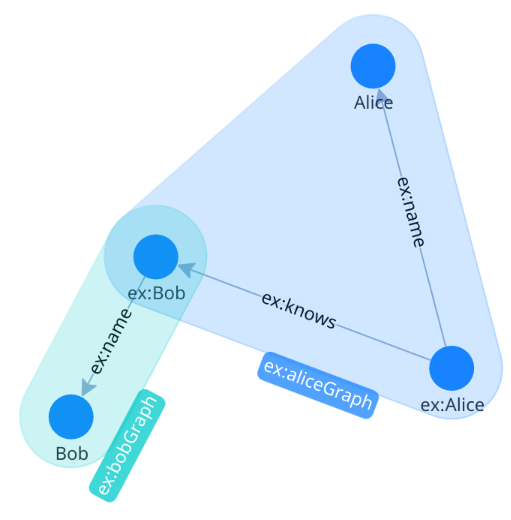

Displays a [TriG](https://en.wikipedia.org/wiki/TriG_(syntax)) file.

A TriG file is a turtle RDF, but specifying the named graphs.

```turtle
 @prefix ex:
<http://example.org/> .

ex:aliceGraph {
    ex:Alice ex:name "Alice" ;
    ex:knows ex:Bob .
}

ex:bobGraph {
    ex:Bob ex:name "Bob" .
}

```

